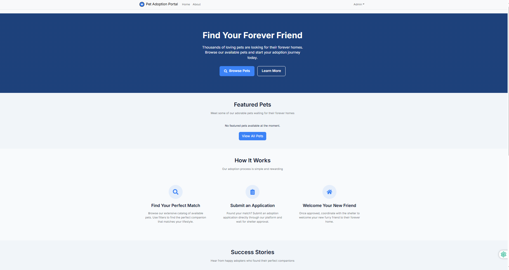
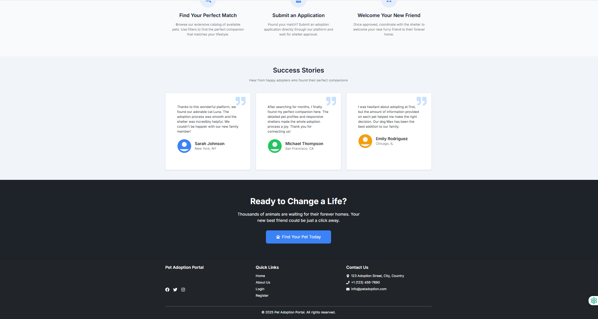
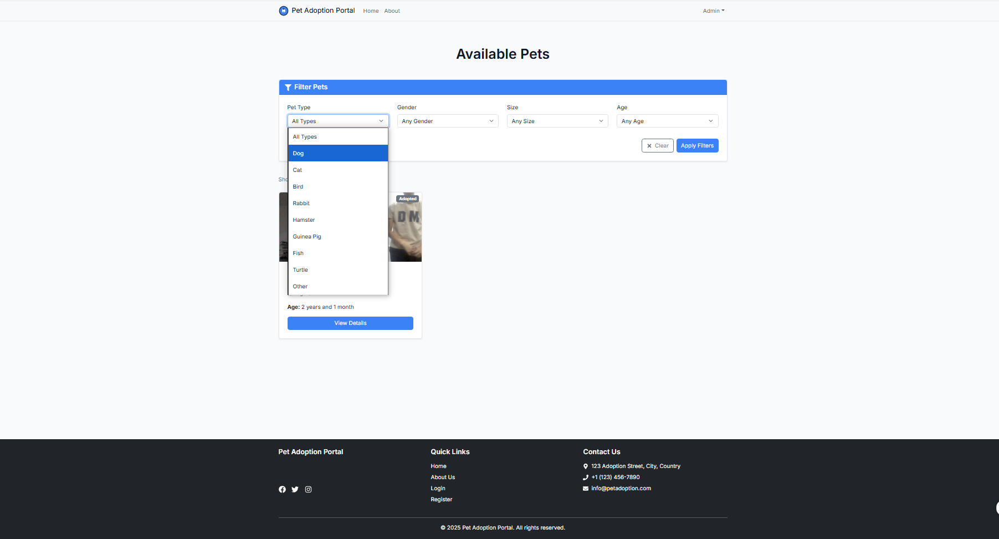
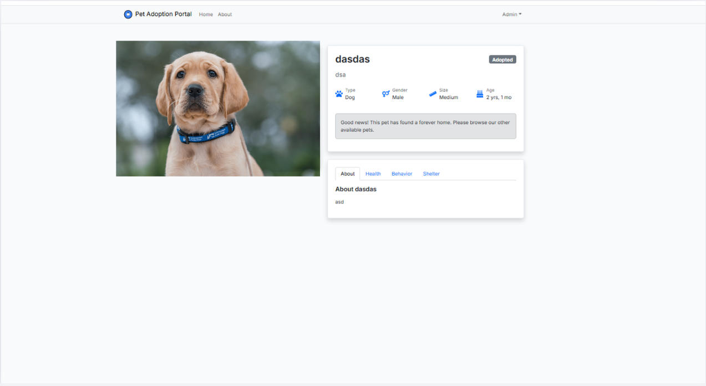
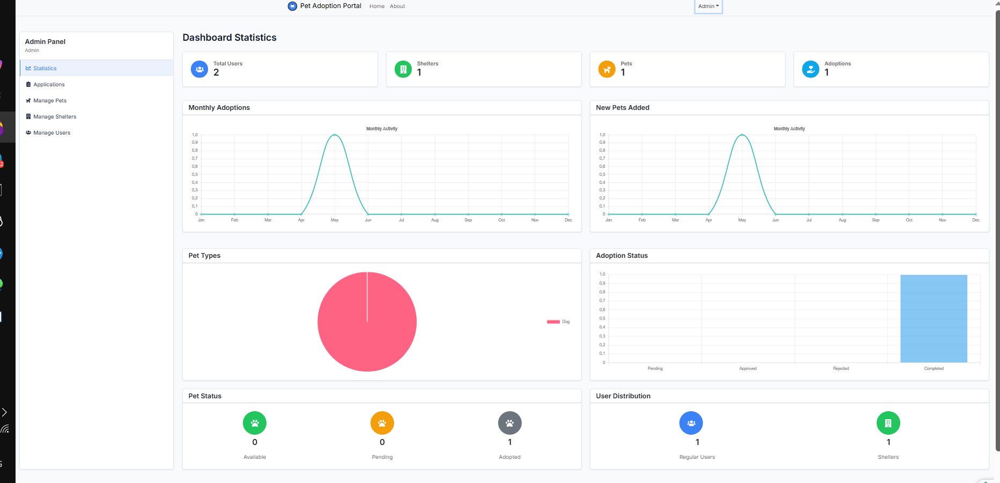

Pet Adoption Portal
Introduction
This project is a web-based platform designed to connect pets in need of adoption with potential adopters. The system allows users to view available pets from various shelters, submit adoption applications, and track the adoption process. Shelters can manage their pet listings, review applications, and track adoption statistics. The goal of this platform is to provide an efficient, user-friendly way for pets to find new homes.

Problem Statement
Many pets in shelters remain in need of a home for extended periods, often due to inefficiencies in the adoption process. Shelters struggle with managing their pet listings, handling adoption applications, and reaching the right adopters. This platform aims to streamline the entire adoption process, making it easier for potential pet owners to find and adopt pets from local shelters, thereby improving the chances of rehoming animals.

Objectives
To create a user-friendly platform for adopters to view pets and submit adoption applications.

To provide shelters with an easy way to manage their pet listings and adoption applications.

To offer administrators the ability to oversee and control the platform’s activities and data.

Technology Stack
Frontend: ReactJS, React Router, React Bootstrap, Axios, React Context API, Chart.js, React-Chartjs-2, Formik, Yup

Backend: Node.js, Express.js, JWT, Bcrypt.js, Express-fileupload

Database: MongoDB, Mongoose

Others: Docker, Docker Compose

Installation Instructions

1. Clone the repository
bash
git clone https://github.com/UmirzakovIIDanial/pet-adoption-portal.git
2. Navigate into the project directory
bash
cd yourrepository
3. Install dependencies
For the frontend:

bash
cd client
npm install
cd ..
For the backend:
bash
cd server
npm install
cd ..

4. Start the application
bash
docker-compose up --build
This will build and run both the frontend and backend services. If you're running the application locally without Docker, you can use npm start in the respective folders.

Note: Make sure you have .env files configured with necessary environment variables (e.g., database connection strings).

Usage Guide
After running the app, navigate to http://localhost:3000 for the frontend and http://localhost:5000 for the backend (if running without Docker).

Here’s how users can interact with the system:

Adopters: Browse available pets, view profiles, and apply for adoption.

Shelters: Add pets to the platform, manage adoption applications, and track adoption statuses.

Admins: Monitor the entire platform, verify shelters, and manage users.

Sample API Endpoints:
GET /api/pets: Fetch all pets available for adoption.

POST /api/adopt: Submit an adoption application for a pet.

Testing
We haven't test

Known Issues / Limitations (Optional)
Mac OS: Some features may not work as expected on Mac OS due to environment-specific configurations.

Mobile Responsiveness: The app is still being optimized for smaller mobile screens.

References
ReactJS Documentation
https://ru.legacy.reactjs.org/docs/getting-started.html

Node.js Documentation
https://nodejs.org/docs/latest/api/

MongoDB Documentation
https://www.mongodb.com/docs/

Team Members
Danial Umirzak, 230103262, 19-P

Ospan Beknur, 230103111, 19-P

Aliaskar Sabitkhan, 230103273, 15-P

Ali Zhanibek, 230103150 19-P

### Home Page

### Adoption Form

